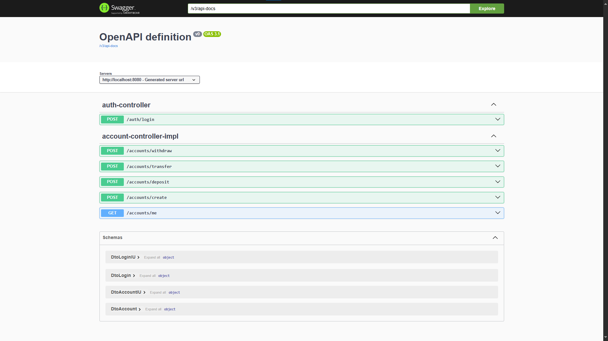

# Spring Boot Bank API




https://github.com/user-attachments/assets/62601d1b-80a7-430b-896d-aca30b106274


## Description
A Spring Boot REST API for bank account management with JWT authentication.  
The API supports account creation, deposit, withdraw, and transfer operations, along with centralized exception handling.

---

## Features
- JWT-based authentication and role management  
- Account creation and retrieval  
- User login with JWT token generation  
- Deposit, withdraw, and transfer money operations  
- Centralized exception handling  
- Clean layered architecture (Controller, Service, Repository, Security, Config)  

---

## Tech Stack
- Java 17  
- Spring Boot 3  
- Spring Security + JWT  
- Spring Data JPA + Hibernate  
- PostgreSQL  
- Maven  

---

## Project Structure
```

spring-boot-bank-api/
│
├─ src/main/java/com/enescidem/
│   ├─ config/
│   │   └─ SecurityConfig.java
│   │
│   ├─ controller/
│   │   ├─ AuthController.java
│   │   ├─ IAccountController.java
│   │   └─ impl/
│   │       ├─ AccountControllerImpl.java
│   │       └─ AuthControllerImpl.java
│   │
│   ├─ dto/
│   │   ├─ DtoAccount.java
│   │   ├─ DtoAccountIU.java
│   │   ├─ DtoLogin.java
│   │   └─ DtoLoginIU.java
│   │
│   ├─ entity/
│   │   └─ Account.java
│   │
│   ├─ repository/
│   │   └─ AccountRepository.java
│   │
│   ├─ security/
│   │   ├─ JwtFilter.java
│   │   └─ JwtUtil.java
│   │
│   ├─ service/
│   │   ├─ IAccountService.java
│   │   ├─ IAuthService.java
│   │   └─ impl/
│   │       ├─ AccountServiceImpl.java
│   │       └─ AuthServiceImpl.java
│   │
│   ├─ exception/
│   │   ├─ BaseException.java
│   │   ├─ ErrorMessage.java
│   │   └─ MessageType.java
│   │
│   └─ handler/
│       ├─ ApiError.java
│       ├─ Exception.java
│       └─ GlobalExceptionHandler.java
│
├─ src/main/resources/
│   └─ application.properties
│
└─ pom.xml

````

---

## Getting Started
### Clone the repository
```bash
git clone https://github.com/username/spring-boot-bank-api.git
cd spring-boot-bank-api
````

### Configure environment variables

Set the following properties in `application.properties`:

```properties
jwt.secret=YourSecretKey
jwt.expiration=300000  # 5 minutes in milliseconds
spring.datasource.url=jdbc:postgresql://localhost:5432/db_name
spring.datasource.username=postgres
spring.datasource.password=password
```

### Build & Run

```bash
mvn clean install
mvn spring-boot:run
```

### API Endpoints

* `POST /auth/login` – Login and receive JWT token
* `POST /accounts/create` – Create a new account
* `GET /accounts/me` – Retrieve logged-in user account
* `POST /accounts/deposit` – Deposit money
* `POST /accounts/withdraw` – Withdraw money
* `POST /accounts/transfer` – Transfer money

---
